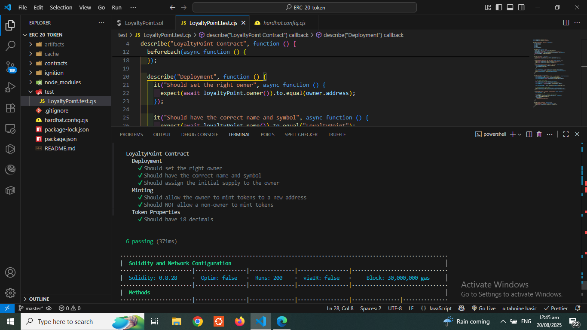

# Loyalty Point Token | ERC-20 Smart Contract

A foundational **ERC-20 token contract** built with Hardhat and OpenZeppelin, this project provides a secure, owner-mintable digital asset designed to power a loyalty and rewards program on the blockchain. This solution has been thoroughly **unit-tested** and was successfully **deployed to the Holesky testnet using Hardhat Ignition**, ensuring its functionality and reliability for a decentralized rewards system.

---

### **Features**

- **ERC-20 Compliance**: A fully standard token that can be integrated with wallets, exchanges, and other decentralized applications.
- **Ownable**: The contract is owned by a single address, providing a secure point of control.
- **Owner-Controlled Minting**: Only the contract owner can create new tokens, ensuring a controlled supply.
- **Hardhat Development Environment**: A complete development setup including a local blockchain for testing and a robust deployment framework.
- **Hardhat Ignition**: A declarative and reliable system for deploying and managing smart contracts.
- **Comprehensive Testing**: The repository includes a full suite of unit tests to verify all core contract functionalities.

---

### **Getting Started**

To set up and run this project locally, follow these steps.

#### **Prerequisites**

- **Node.js & npm**: [Download and install Node.js](https://nodejs.org/) (which includes npm).
- **Git**: [Download and install Git](https://git-scm.com/downloads) to clone the repository.

#### **Installation**

1.  Clone the repository to your local machine:
    ```bash
    git clone https://github.com/molalign8468/loyalty-point-token.git
    cd loyalty-point-token
    ```
2.  Install the project dependencies:
    ```bash
    npm install
    ```

#### **Running Tests**

Before deployment, it's crucial to run the unit tests to ensure all contract logic works as expected.

```bash
npx hardhat test
```

A successful test run will show output similar to the image below.

## 

### **Deployment**

The project is configured for deployment to the Holesky testnet using Hardhat Ignition.

#### **Environment Setup**

Create a `.env` file in the root of your project with the following variables:

```
ALCHEMY_HOLESKY_URL="YOUR_ALCHEMY_URL"
PRIVATE_KEY="YOUR_PRIVATE_KEY"
ETHERSCAN_API_KEY="YOUR_ETHERSCAN_API_KEY"
```

- `ALCHEMY_HOLESKY_URL`: Your Alchemy RPC URL for the Holesky network.
- `PRIVATE_KEY`: The private key of the wallet you'll use to deploy the contract. **Warning: Keep this key secure.**
- `ETHERSCAN_API_KEY`: An API key for Etherscan to automatically verify your contract after deployment.

#### **Running the Deployment**

To deploy the `LoyaltyPoint` contract, run the following command:

```bash
npx hardhat ignition deploy ignition/modules/LoyaltyPointModule.js --network holesky
```

---

---

## 📜 Deployed Contract

This ERC-20 token has been deployed to the **Holesky Testnet**.

- **Contract Address**: `0xA2F59450bCcB810D83DA87a78B659899C426329b`
- **Etherscan Link**: [View on Holesky Etherscan](https://holesky.etherscan.io/token/0xA2F59450bCcB810D83DA87a78B659899C426329b)

---

### **Verification & Visualization**

After a successful deployment, you can verify your contract on Etherscan and add your token to MetaMask.

#### **Etherscan Verification**

The `hardhat-etherscan` plugin automatically verifies your contract, making its source code public. This is crucial for transparency and security. A verified contract page will look like this:


#### **Adding the Token to MetaMask**

After deployment, you can import your custom token into MetaMask.

1.  Copy your newly deployed token's contract address from the terminal output.
2.  In MetaMask, click "Import tokens" and paste the contract address. The token symbol (`LP`) and decimals (`18`) will auto-populate.
3.  Click "Import" to see the token balance in your wallet.

---

## 📄 License

MIT License © 2025 Molalign

Permission is granted to use, copy, modify, and distribute this software for any purpose with attribution.  
This software is provided "as is", without warranty of any kind.
